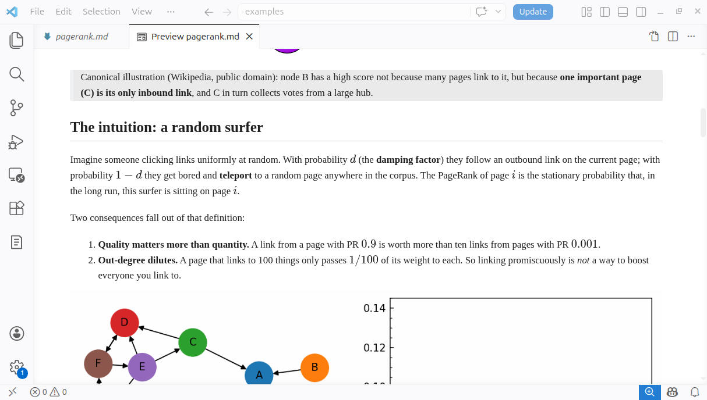
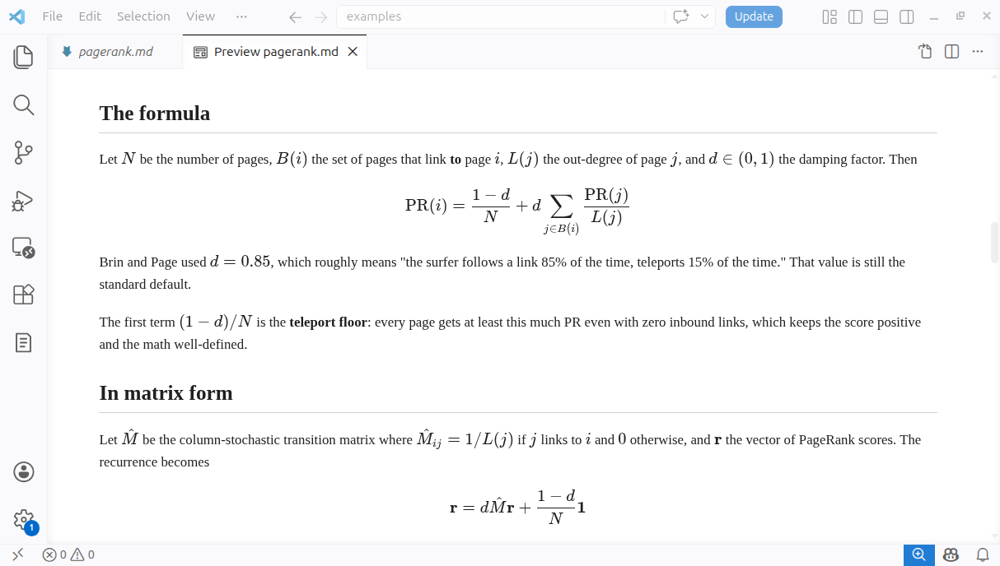

# MediaNote

A VS Code extension that turns your workspace into an Obsidian-style notes vault — with `[[wiki-links]]`, backlinks, `#tags`, **multi-media attachments**, configurable preview typography, and **self-contained HTML/PDF export**.

Your `.md` files *are* the vault. No database, no sync layer, no proprietary format — plain markdown in plain folders. Everything else (backlinks, the table of contents, exported HTML/PDF) is generated at view/export time; nothing is silently written back into your notes.



---

## Highlights

- `[[wiki-links]]`, backlinks, and `#tags` across your workspace.
- Drag, paste, or insert **any** file — audio, video, images, and other documents. Files from outside the workspace are copied into a per-note `attachments/` folder so links stay portable.
- **Backlinks** in a tree view *and* auto-rendered at the bottom of the preview — never written into your `.md` files.
- Wiki-links, audio/video embeds, image sizing, math, and a table-of-contents directive (`\tableofcontents`, `[toc]`, or `[TOC]`) all render in VS Code's built-in Markdown preview.
- Rename or move a note (or an attachment) and the links to it are updated automatically.
- User-configurable preview body and code fonts.
- **Self-contained HTML and PDF export** with KaTeX bundled offline.
- Pure markdown. No vault file. Move folders freely; links stay relative.

---

## Features

### Wiki-links

```
See also [[Pagerank]] and [[Reading List|further reading]].
Check the [[Pagerank#Stationary distribution]] section.
```

- Basename-based, case-insensitive resolution anywhere in the workspace — `[[Foo]]` finds `Foo.md` in any folder.
- `[[Target|alias]]` and `[[Target#section]]` are supported. Clicking a `#section` link (or **Go to Definition**) jumps to that heading.
- Editor language features: hover preview, go-to-definition, completion (typing `[[` lists your notes), and find-all-references.
- Clicking a wiki-link to a note that doesn't exist yet **creates it** under `medianote.newNoteFolder` and opens it.

### Backlinks

The notes that link *to* the current note, surfaced two ways — and **never written into your `.md` files**:

- A **Backlinks** tree view in the activity bar, which updates as you switch notes and as links are added or removed.
- An auto-generated `## Backlinks` section at the bottom of the Markdown preview.

### Tags

- Write `#tag` anywhere in a note; nested tags like `#proj/sub-task` are supported.
- A **Tags** tree view in the activity bar lists every tag with its note count; expand a tag to see (and open) the notes that use it.
- **MediaNote: Search Notes by Tag** lets you pick a tag and jump to one of its notes.

### Notes view

A **Notes** tree view in the activity bar lists every markdown file in the workspace, with its folder shown alongside — a quick index of the whole vault.

### Multi-media attachments

- **Drag-drop or paste** a file from anywhere — your file manager, a browser, or the clipboard.
- Files from **outside the workspace** are copied into a per-note `attachments/` folder (configurable via `medianote.attachmentsFolder`); files already inside the workspace are linked in place.
- Inserted by file kind:
  - **Audio / video** → `![[clip.mp4]]` embed → renders as an `<audio>`/`<video>` player in the preview.
  - **Images** → `` inline.
  - **Other markdown notes** → `[[wiki-link]]`.
  - **Everything else** → `[name](path)` link.
- **Insert Link** (`Ctrl/Cmd+Alt+L`) opens a picker to choose a note or browse for any file, then inserts the right snippet for the detected type automatically.
- Sized images via the GitLab/Pandoc syntax: `` or `=x200`.
- If `ffmpeg` and `ffprobe` are on your `PATH`, the audio track of a newly-imported video that isn't already MP3 is transcoded to MP3 for broader in-preview playback. Without them, the file is kept as-is and you're warned once.

> **Note:** MediaNote inserts and links files, but it doesn't open or render non-markdown files itself — VS Code has no built-in viewer for PDFs, Word/PowerPoint/Excel documents, etc. To open a linked file from inside VS Code, install an extension that handles that type (e.g. **vscode-pdf** for PDFs).

### Preview

MediaNote extends VS Code's built-in Markdown preview (`Ctrl/Cmd+Shift+V`) rather than shipping its own. There you get:

- **Wiki-links** rendered as real links — click one to open that note; `#section` links scroll to the heading.
- **Audio / video embeds** (`![[clip.mp4]]`) as `<video>`/`<audio>` players, and `` image sizing.
- **Math** — `$…$` and `$$…$$` render via VS Code's built-in Markdown math support.
- A generated **table of contents** wherever you place the directive, and a generated **Backlinks** section at the bottom.
- Your configured **preview fonts**.



### Table of contents

Put a single line `\tableofcontents`, `[toc]`, or `[TOC]` where you want it. The preview replaces it with a generated nested, auto-numbered ToC (`1`, `1.1`, `1.2`, …) of the note's level-2+ headings, under a "Table of Contents" header. The directive stays in the source — **the file is not modified** — and the ToC also appears in exported HTML/PDF. Toggle with `medianote.tableOfContents`.

### Configurable typography

```jsonc
// Defaults:
"medianote.previewFont":     "'Times New Roman', Times, serif",
"medianote.previewCodeFont": "'JetBrains Mono', Consolas, monospace"
```

Set your own body and code fonts for VS Code's built-in Markdown preview (the same values are carried into export). Leave a setting empty to fall back to VS Code's default font.

### Self-contained export

**MediaNote: Export Note (HTML / PDF)** (also on the editor title bar, editor context menu, and Explorer context menu for `.md` files):

- **HTML** — a single standalone file. KaTeX CSS is inlined and its web fonts are embedded as base64 woff2 data URIs, so the exported file renders math **with no network access**. Safe to email or archive.
- **PDF** — rendered via a headless Chrome/Chromium/Edge that's auto-detected across common install locations (override with `medianote.exportPdfBrowserPath`).

Attachments resolve relative to the note's directory via a `<base href>`, so you don't need to copy them. After exporting, a notification offers **Open** and **Reveal in Explorer**.

### Rename-aware links

Rename or move a file in the Explorer and MediaNote rewrites the links that pointed at it, inside a single undoable edit:

- Renaming a note updates the `[[wiki-links]]` in every note that referenced it.
- Renaming any file (note or attachment) updates path-based references to it — `![[path]]` embeds, `` images, and `[text](path)` links — across the vault. Links inside fenced code blocks are left alone.

---

## How MediaNote differs from other markdown extensions

MediaNote sits in a specific niche: a **multi-media notes** experience on top of plain markdown, with a strict rule that **the source file is the source of truth — generated content (backlinks, ToC, exported HTML) lives outside it**.

- **vs. Markdown All in One** — that extension excels at editor helpers (list continuation, table formatting, source-side ToC, shortcuts) but has no wiki-links, backlinks, tags, or attachments. The two coexist well.
- **vs. Foam / Markdown Notes** — these share the `[[wiki-link]]`/backlink vocabulary but center on knowledge-graph workflows. MediaNote emphasizes **multi-media attachments** (embedded players, image sizing) and **offline-self-contained HTML/PDF export**, and keeps backlinks out of your source files.
- **vs. Markdown Preview Enhanced** — MPE is a feature-rich custom preview. MediaNote instead *extends* VS Code's built-in preview and focuses on first-class attachments and offline export.
- **vs. Obsidian** — the closest cousin, but a separate app. MediaNote brings a similar workflow to VS Code natively, on a plain `.md` workspace with no vault file or proprietary index — at the cost of fewer plugins and no graph view.

---

## Configuration

| Setting | Default | Purpose |
|---|---|---|
| `medianote.newNoteFolder` | `""` | Default folder for new notes (relative to workspace; empty = root) |
| `medianote.attachmentsFolder` | `"attachments"` | Folder name for copied/inserted files, a sibling of the note |
| `medianote.tableOfContents` | `true` | Render a ToC where a note has `\tableofcontents`, `[toc]`, or `[TOC]` |
| `medianote.previewFont` | `'Times New Roman', Times, serif` | Body font in the preview |
| `medianote.previewCodeFont` | `'JetBrains Mono', Consolas, monospace` | Code font in the preview |
| `medianote.exclude` | `**/node_modules/**` | Glob excluded from the note index |
| `medianote.exportPdfBrowserPath` | `""` | Path to Chrome/Chromium/Edge for PDF export (auto-detect if empty) |

---

## Keyboard shortcuts

| Shortcut | Action |
|---|---|
| `Ctrl/Cmd+Alt+N` | New note |
| `Ctrl/Cmd+Alt+F` | Search notes by name |
| `Ctrl/Cmd+Alt+L` | Insert link (note or file — type auto-detected) |

Use VS Code's default `Ctrl/Cmd+Shift+V` to open the Markdown preview.

---

## Building from source

```bash
npm install
npm run compile     # one-shot tsc -p ./ -> out/
npm run watch       # incremental compile during development
```

Press **F5** in VS Code to launch the Extension Development Host with the extension loaded.

The build is plain TypeScript; `tsc` with `strict: true` is the correctness gate. There's no separate test runner or linter — the extension keeps a small surface area on top of VS Code's APIs.

---

## Privacy

MediaNote is **fully local**. Nothing about your notes leaves your machine:

- **No telemetry, no analytics, no remote calls.** The extension makes zero network requests.
- Your `.md` files, attachments, and the in-memory index stay in your workspace. The extension only reads/writes files under it (plus the per-note `attachments/` folder for files you bring in from outside).
- **Math rendering is offline.** KaTeX is bundled as a runtime dependency and inlined into exports — no CDN. Exported HTML is fully self-contained.
- **PDF export runs locally.** It spawns your installed Chrome/Chromium/Edge in headless mode; the file never goes through a remote service.
- The only generated state on disk is your `.md` files, your attachments, and a single `media/preview.css` (regenerated from your font settings on activation).

The entire source is in `src/` (under ~10 TypeScript files) and makes no network calls — there is no `fetch`, `http.request`, or HTTP-client library anywhere. The only `http` strings you'll find are a URL-matching regex and comments in the export code, used to *skip* rewriting genuine external links, never to fetch them.

## License

[MIT](LICENSE) © 2026 norsnoise.
