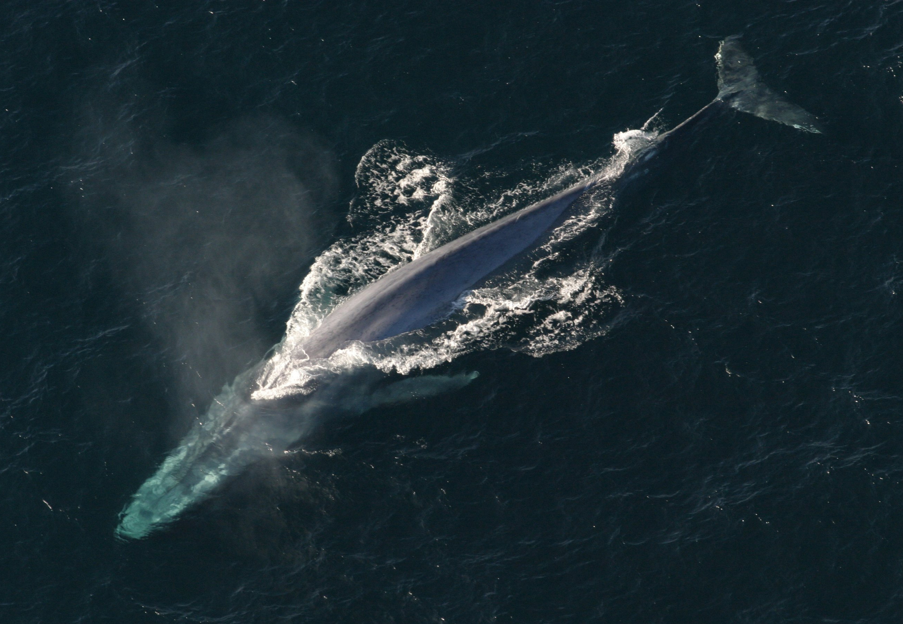
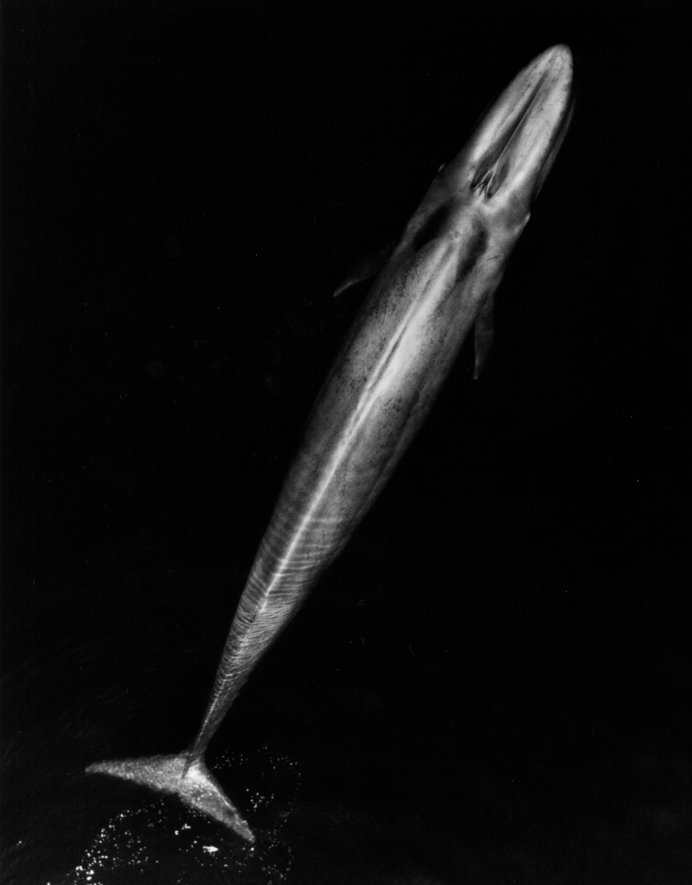

# Blue whale

The **blue whale** (*Balaenoptera musculus*) is the largest animal known to have ever existed — larger than any dinosaur. An adult can stretch past 30 m and weigh up to 200 t, eats almost nothing but krill, and was hunted to the brink of extinction in the 20th century before recovering modestly under international protection.

## How big, really

Numbers stop being intuitive at this scale, so a comparison helps:

- **Length** — typical adults are 24–30 m; the longest confirmed individual was 33 m (108 ft). For reference, that's longer than a basketball court.
- **Mass** — up to ~200 metric tons. A large male African elephant weighs ~6 t, so one blue whale ≈ 30+ elephants.
- **Heart** — about 180 kg (400 lb), roughly the size of a small car. Resting heart rate at depth dips as low as 2 bpm.
- **Tongue** — ~2.7 t, heavier than most cows.
- **Calf at birth** — already 6–7 m long and 2–3 t. They gain ~90 kg per *day* nursing on fat-rich milk.

## Anatomy and biology

Blue whales are baleen whales (suborder Mysticeti). Instead of teeth, they have 270–395 plates of keratin **baleen** hanging from the upper jaw, forming a sieve. They are **lunge feeders**: they accelerate into a krill swarm with mouth agape, balloon their pleated throat pouch to engulf 70+ tonnes of water, then push the water out through the baleen, trapping the krill inside.

A single adult consumes roughly **1–4 tonnes of krill per day** — about 40 million individual krill — during the summer feeding season.

### Subspecies

Four are generally recognized:

| Subspecies | Range |
|---|---|
| *B. m. musculus* | North Atlantic and North Pacific |
| *B. m. intermedia* | Southern Ocean (Antarctic) — the largest |
| *B. m. brevicauda* | Indian Ocean and southern Pacific (pygmy blue whale) |
| *B. m. indica* | Northern Indian Ocean |

## Song

Blue whale calls are among the **loudest sounds made by any animal**, reaching up to 188 dB (re 1 µPa at 1 m) — measurable hundreds of kilometres away under good conditions. The fundamental frequency sits between **8 and 25 Hz**, mostly below the threshold of human hearing. Each population has a distinctive song pattern, and intriguingly, the dominant frequency of blue whale songs worldwide has been **slowly dropping since at least the 1960s** — nobody fully understands why.

## Range, migration, and lifestyle

Blue whales live in every ocean except the Arctic, the Mediterranean, and a few enclosed seas. Most populations migrate between **polar feeding grounds in summer** (where krill biomass is enormous) and **tropical or subtropical breeding grounds in winter**. They are typically solitary or in mother–calf pairs, occasionally forming loose feeding aggregations where prey is dense.

Gestation lasts 10–12 months. Calves nurse for 6–8 months and are weaned around the time the mother returns to feeding grounds. Females breed every 2–3 years.

## Conservation

- **IUCN status:** Endangered.
- **Estimated global population:** 10,000–25,000 individuals (2015 IUCN estimate), of which 5,000–15,000 are mature. Pre-whaling Southern Hemisphere population alone may have been **~239,000**.
- 20th-century industrial whaling, especially in the Antarctic, killed an estimated 360,000+ blue whales. The IWC banned blue whale hunting in **1966**, though Soviet illegal whaling continued into the 1970s.
- Modern threats: ship strikes (a leading cause of mortality in heavily-trafficked coasts like California), entanglement in fishing gear, ocean noise interfering with communication, and prey shifts driven by climate change.

## Quick reference

| | |
|---|---|
| Scientific name | *Balaenoptera musculus* |
| Order / Family | Cetacea / Balaenopteridae (rorquals) |
| Max length | ~30 m (33 m extreme) |
| Max mass | ~200 t |
| Diet | Krill (almost exclusively) |
| Daily intake | 1–4 t krill |
| Lifespan | 80–90 years (oldest documented ~110) |
| Gestation | 10–12 months |
| Song frequency | 8–25 Hz |
| Song loudness | up to 188 dB |
| IUCN status | Endangered |

## References

- *Blue whale* — Wikipedia. <https://en.wikipedia.org/wiki/Blue_whale>
- NOAA Fisheries — *Blue Whale* species profile. <https://www.fisheries.noaa.gov/species/blue-whale>
- IUCN Red List (2018) — *Balaenoptera musculus*. <https://www.iucnredlist.org/species/2477/156923585>
- National Geographic — *Blue whale facts and photos*. <https://www.nationalgeographic.com/animals/mammals/facts/blue-whale>
- Britannica — *Blue whale: Length, Weight, & Facts*. <https://www.britannica.com/animal/blue-whale>
- IFAW — *Blue whales: Facts, threats, and our conservation plan*. <https://www.ifaw.org/animals/blue-whales>
- Sears, R. & Perrin, W. F. (2009). *Blue whale: Balaenoptera musculus* in *Encyclopedia of Marine Mammals*, 2nd ed.
- McDonald, M. A., Hildebrand, J. A. & Mesnick, S. (2009). *Worldwide decline in tonal frequencies of blue whale songs.* Endangered Species Research 9: 13–21.

See also: [[glossary]], [[reading-list]]
