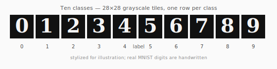
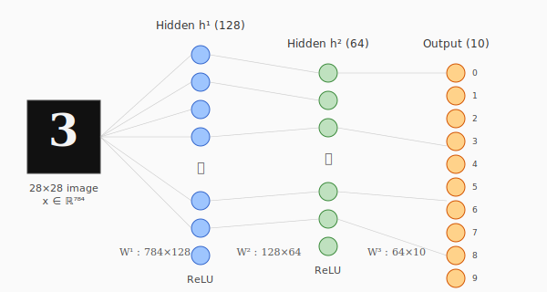
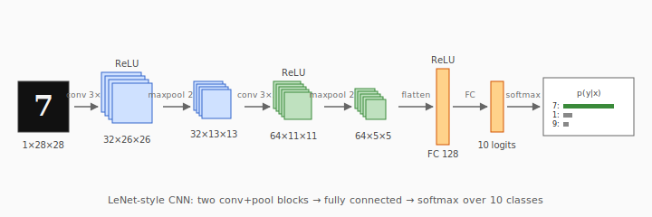

# Hand-written Digit Classification with Neural Networks

The "hello world" of computer vision: given a 28×28 grayscale image of a hand-written digit, predict which of the ten classes $\{0, 1, \dots, 9\}$ it belongs to. The task is small enough to train on a laptop in minutes, but rich enough that every essential idea in modern deep learning — feature hierarchies, stochastic gradient descent, softmax cross-entropy, convolution, regularization — shows up.

The standard benchmark is **MNIST** ([LeCun, Cortes & Burges, 1998](http://yann.lecun.com/exdb/mnist/)): 60,000 training and 10,000 test images, drawn from US Census Bureau employees and high-school students, centered and size-normalized. State-of-the-art on MNIST has been >99.7% test accuracy for over a decade; the value of the dataset now is as a fast sanity check, not as a research target.



## Problem setup

We have a dataset $\mathcal{D} = \{(x_i, y_i)\}_{i=1}^{N}$ where each $x_i \in \mathbb{R}^{784}$ is the image flattened into a vector and $y_i \in \{0, \dots, 9\}$ is the label. We learn a classifier $f_\theta : \mathbb{R}^{784} \to \Delta^{9}$ that maps an image to a probability distribution over the ten classes (a point on the 9-simplex). The prediction is

$$
\hat{y}(x) = \arg\max_{c \in \{0,\dots,9\}} f_\theta(x)_c .
$$

Training fits $\theta$ to minimize the empirical risk under cross-entropy loss; testing measures accuracy on held-out data.

## A simple MLP

The smallest model that does respectably well is a two-layer multi-layer perceptron (MLP). It treats each pixel as a feature and learns a stack of affine + nonlinearity transforms.



Layer-wise:

$$
\begin{aligned}
h^{(1)} &= \mathrm{ReLU}(W^{(1)} x + b^{(1)}) \in \mathbb{R}^{128} \\
h^{(2)} &= \mathrm{ReLU}(W^{(2)} h^{(1)} + b^{(2)}) \in \mathbb{R}^{64} \\
z       &= W^{(3)} h^{(2)} + b^{(3)} \in \mathbb{R}^{10} \\
p_c     &= \mathrm{softmax}(z)_c = \frac{e^{z_c}}{\sum_{k=0}^{9} e^{z_k}}
\end{aligned}
$$

Here $\mathrm{ReLU}(u) = \max(0, u)$ applied element-wise, and the parameters are $\theta = (W^{(1)}, b^{(1)}, W^{(2)}, b^{(2)}, W^{(3)}, b^{(3)})$. The total parameter count is

$$
784 \cdot 128 + 128 + 128 \cdot 64 + 64 + 64 \cdot 10 + 10 = 109{,}386
$$

— about a hundred thousand parameters, which is tiny by modern standards but enough to overfit MNIST if you don't regularize.

## Softmax + cross-entropy

With a one-hot target $y \in \{0,1\}^{10}$, the **categorical cross-entropy** loss for a single example is

$$
\mathcal{L}(\theta; x, y) = -\sum_{c=0}^{9} y_c \log p_c = -\log p_{y^*}
$$

where $y^*$ is the true class. The expected loss over the dataset is what we minimize. Cross-entropy is the *negative log-likelihood* of the data under the model — minimizing it is maximum-likelihood estimation.

A useful identity: the gradient of softmax + cross-entropy with respect to the logits collapses to a clean form,

$$
\frac{\partial \mathcal{L}}{\partial z_c} = p_c - y_c .
$$

This is why nearly every framework fuses them into a single `softmax_cross_entropy` op — it's numerically stable (you can avoid computing $\log \sum e^{z_k}$ directly via the log-sum-exp trick) and the backward pass is a one-liner.

## Backpropagation in one breath

Given the chain rule, gradients flow backward layer by layer. For the MLP above:

$$
\begin{aligned}
\delta^{(3)} &= p - y \\
\frac{\partial \mathcal{L}}{\partial W^{(3)}} &= \delta^{(3)} (h^{(2)})^\top \\
\delta^{(2)} &= (W^{(3)})^\top \delta^{(3)} \odot \mathbb{1}[h^{(2)} > 0] \\
\frac{\partial \mathcal{L}}{\partial W^{(2)}} &= \delta^{(2)} (h^{(1)})^\top \\
\delta^{(1)} &= (W^{(2)})^\top \delta^{(2)} \odot \mathbb{1}[h^{(1)} > 0] \\
\frac{\partial \mathcal{L}}{\partial W^{(1)}} &= \delta^{(1)} x^\top
\end{aligned}
$$

The $\mathbb{1}[\cdot > 0]$ factor is the ReLU derivative — it's a hard gate that lets gradient through for active units and kills it for dead ones. (The discontinuity at zero is measure-zero and doesn't matter in practice.) Bias gradients are just $\delta^{(\ell)}$.

Parameters are then updated with **stochastic gradient descent**, typically with momentum or its adaptive cousin Adam ([Kingma & Ba, 2014](https://arxiv.org/abs/1412.6980)):

$$
\theta_{t+1} = \theta_t - \eta \, \widehat{\nabla \mathcal{L}}(\theta_t)
$$

where $\widehat{\nabla \mathcal{L}}$ is the gradient on a mini-batch (typically 64–256 examples) and $\eta$ is the learning rate.

## PyTorch implementation

End-to-end training fits in about thirty lines:

```python
import torch
import torch.nn as nn
import torch.nn.functional as F
from torch.utils.data import DataLoader
from torchvision import datasets, transforms

device = "cuda" if torch.cuda.is_available() else "cpu"

transform = transforms.Compose([
    transforms.ToTensor(),                          # [0,255] uint8 → [0,1] float
    transforms.Normalize((0.1307,), (0.3081,)),     # MNIST mean/std
])
train = DataLoader(datasets.MNIST(".", train=True,  download=True, transform=transform),
                   batch_size=128, shuffle=True)
test  = DataLoader(datasets.MNIST(".", train=False, download=True, transform=transform),
                   batch_size=512)

class MLP(nn.Module):
    def __init__(self):
        super().__init__()
        self.fc1 = nn.Linear(28 * 28, 128)
        self.fc2 = nn.Linear(128, 64)
        self.fc3 = nn.Linear(64, 10)

    def forward(self, x):
        x = x.view(x.size(0), -1)        # flatten
        x = F.relu(self.fc1(x))
        x = F.relu(self.fc2(x))
        return self.fc3(x)               # raw logits; loss applies softmax

model = MLP().to(device)
opt   = torch.optim.Adam(model.parameters(), lr=1e-3)

for epoch in range(5):
    model.train()
    for x, y in train:
        x, y = x.to(device), y.to(device)
        loss = F.cross_entropy(model(x), y)
        opt.zero_grad(); loss.backward(); opt.step()

    model.eval()
    correct = 0
    with torch.no_grad():
        for x, y in test:
            x, y = x.to(device), y.to(device)
            correct += (model(x).argmax(1) == y).sum().item()
    print(f"epoch {epoch}: test accuracy = {correct / len(test.dataset):.4f}")
```

On a laptop CPU this takes a few minutes and reaches about **97.8%** test accuracy. Same model with `nn.Dropout(0.2)` between layers and a bit more training pushes it to **98.2%**.

## Convolutions: exploiting spatial structure

The MLP throws away the fact that pixels have *neighbors*. A convolutional net keeps that geometry: each convolutional filter is a small set of weights that slides across the image and looks for a local pattern (an edge, a corner, a stroke). Stacking conv layers builds up a hierarchy of features — early layers fire on simple edges, later layers on digit-shaped strokes.



For an input feature map $x \in \mathbb{R}^{C_\text{in} \times H \times W}$ and a kernel $k \in \mathbb{R}^{C_\text{out} \times C_\text{in} \times K \times K}$, a 2-D convolution (technically cross-correlation) computes

$$
(k * x)_{c, i, j} = \sum_{c'=1}^{C_\text{in}} \sum_{u=0}^{K-1} \sum_{v=0}^{K-1} k_{c, c', u, v} \cdot x_{c', i + u, j + v}
$$

with output spatial size $(H - K + 1) \times (W - K + 1)$ for unit stride, no padding. **Max pooling** then takes the maximum over $2 \times 2$ windows, halving spatial extent and giving small translation invariance.

In PyTorch:

```python
class CNN(nn.Module):
    def __init__(self):
        super().__init__()
        self.conv1 = nn.Conv2d(1,  32, kernel_size=3)
        self.conv2 = nn.Conv2d(32, 64, kernel_size=3)
        self.fc1   = nn.Linear(64 * 5 * 5, 128)
        self.fc2   = nn.Linear(128, 10)

    def forward(self, x):
        x = F.max_pool2d(F.relu(self.conv1(x)), 2)   # 32×13×13
        x = F.max_pool2d(F.relu(self.conv2(x)), 2)   # 64× 5× 5
        x = x.flatten(1)
        x = F.relu(self.fc1(x))
        return self.fc2(x)
```

About 220k parameters, with most of them in the FC layer. Same training loop as the MLP; reaches **>99.0%** in five epochs, **~99.3%** with a bit of data augmentation (small random rotations and translations) and dropout. Modern CNNs with residual connections and batch normalization push this past **99.7%** — the remaining errors are mostly ambiguous digits even a human would dispute.

## Why CNNs beat MLPs on images

Two structural priors that MLPs lack:

1. **Locality.** A $3 \times 3$ filter only sees nine neighboring pixels at a time, so it can't memorize arbitrary global patterns. This is a strong inductive bias toward features that are *local*, which is exactly what early visual processing should look like.
2. **Weight sharing.** The same filter is applied at every spatial position, so the parameter count is independent of $H \times W$ — a $3 \times 3$ filter has nine weights whether the image is $28 \times 28$ or $1024 \times 1024$. This both shrinks the search space (less overfitting) and bakes in **translation equivariance**: shift the input, the feature map shifts the same way.

The cost is that you lose the ability to learn position-dependent features (e.g. "is this pixel near the top-left?"), but that's exactly what you want for a digit classifier — the 7 in the top-left and the 7 in the center should be the same 7.

## Regularization and pitfalls

A few things consistently move test accuracy:

- **Data augmentation** — random rotations of $\pm 10°$, translations of $\pm 2$ pixels, and small affine warps roughly double the effective dataset size. Worth more than any architecture tweak on MNIST.
- **Dropout** ([Srivastava et al., 2014](https://www.jmlr.org/papers/v15/srivastava14a.html)) — randomly zero a fraction of activations during training. $p = 0.2$–$0.5$ in the FC layers is standard.
- **Weight decay** — add $\lambda \|\theta\|_2^2$ to the loss. Sometimes spelled $\ell_2$ regularization; with Adam, use [AdamW](https://arxiv.org/abs/1711.05101) which decouples it from the gradient step.
- **Learning rate schedule** — start at $10^{-3}$, decay by $0.1\times$ when validation loss plateaus.
- **Don't train on the test set.** Tempting on a small benchmark. Keep at least 5,000 examples of the training set aside as a validation split.

A common rookie mistake is to **forget normalization**. MNIST pixels in $[0, 1]$ have mean $\approx 0.13$ and std $\approx 0.31$. Subtracting the mean and dividing by the std (as in the `Normalize` transform above) makes gradients well-conditioned and shaves significant training time.

## Beyond MNIST

MNIST is too easy. Standard next steps:

- **Fashion-MNIST** ([Xiao et al., 2017](https://arxiv.org/abs/1708.07747)) — same shape and size, but ten clothing categories. Harder; CNNs reach about 93%.
- **CIFAR-10 / CIFAR-100** ([Krizhevsky, 2009](https://www.cs.toronto.edu/~kriz/learning-features-2009-TR.pdf)) — $32 \times 32$ color images, ten / a hundred categories. The starting point for real architecture research.
- **ImageNet** ([Deng et al., 2009](http://www.image-net.org/papers/imagenet_cvpr09.pdf)) — million-image, thousand-class natural images. The dataset that triggered the deep-learning revolution after AlexNet's 2012 result.


## References

- LeCun, Y., Bottou, L., Bengio, Y., & Haffner, P. (1998). *Gradient-based learning applied to document recognition.* Proc. IEEE 86(11):2278–2324. <http://yann.lecun.com/exdb/publis/pdf/lecun-98.pdf>
- Krizhevsky, A., Sutskever, I., & Hinton, G. E. (2012). *ImageNet classification with deep convolutional neural networks.* NeurIPS. <https://papers.nips.cc/paper/4824-imagenet-classification-with-deep-convolutional-neural-networks>
- Srivastava, N., Hinton, G., Krizhevsky, A., Sutskever, I., & Salakhutdinov, R. (2014). *Dropout: a simple way to prevent neural networks from overfitting.* JMLR 15:1929–1958. <https://www.jmlr.org/papers/v15/srivastava14a.html>
- Kingma, D. P. & Ba, J. (2014). *Adam: A method for stochastic optimization.* <https://arxiv.org/abs/1412.6980>
- He, K., Zhang, X., Ren, S., & Sun, J. (2016). *Deep residual learning for image recognition.* CVPR. <https://arxiv.org/abs/1512.03385>
- Goodfellow, I., Bengio, Y. & Courville, A. (2016). *Deep Learning.* MIT Press. <https://www.deeplearningbook.org/>

