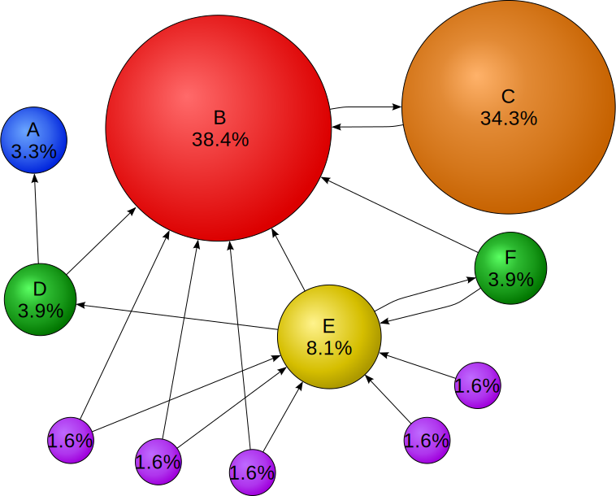
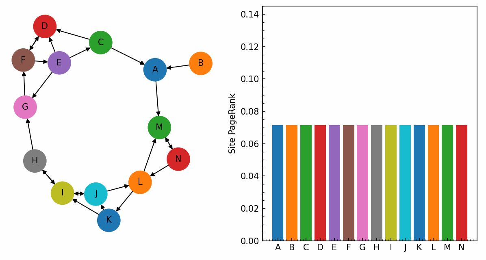

# PageRank

PageRank is the link-analysis algorithm that bootstrapped Google. It assigns every page in a hyperlinked corpus a non-negative score representing its "importance" — and the key trick is that importance is **recursive**: a page is important if important pages link to it.

Originally written up by Larry Page and Sergey Brin while at Stanford, with Rajeev Motwani and Terry Winograd. The 1999 tech report ([Page et al., 1999](http://ilpubs.stanford.edu:8090/422/)) is still the most readable source.

> Canonical illustration (Wikipedia, public domain): node B has a high score not because many pages link to it, but because **one important page (C) is its only inbound link**, and C in turn collects votes from a large hub.

## The intuition: a random surfer

Imagine someone clicking links uniformly at random. With probability $d$ (the **damping factor**) they follow an outbound link on the current page; with probability $1-d$ they get bored and **teleport** to a random page anywhere in the corpus. The PageRank of page $i$ is the stationary probability that, in the long run, this surfer is sitting on page $i$.

Two consequences fall out of that definition:

1. **Quality matters more than quantity.** A link from a page with PR $0.9$ is worth more than ten links from pages with PR $0.001$.
2. **Out-degree dilutes.** A page that links to 100 things only passes $1/100$ of its weight to each. So linking promiscuously is *not* a way to boost everyone you link to.

## The formula

Let $N$ be the number of pages, $B(i)$ the set of pages that link **to** page $i$, $L(j)$ the out-degree of page $j$, and $d \in (0, 1)$ the damping factor. Then

$$
\mathrm{PR}(i) = \frac{1-d}{N} + d \sum_{j \in B(i)} \frac{\mathrm{PR}(j)}{L(j)}
$$

Brin and Page used $d = 0.85$, which roughly means "the surfer follows a link 85% of the time, teleports 15% of the time." That value is still the standard default.

The first term $(1-d)/N$ is the **teleport floor**: every page gets at least this much PR even with zero inbound links, which keeps the score positive and the math well-defined.

## In matrix form

Let $\hat M$ be the column-stochastic transition matrix where $\hat M_{ij} = 1/L(j)$ if $j$ links to $i$ and $0$ otherwise, and $\mathbf{r}$ the vector of PageRank scores. The recurrence becomes

$$
\mathbf{r} = d \hat M \mathbf{r} + \frac{1-d}{N} \mathbf{1}
$$

So $\mathbf{r}$ is the dominant eigenvector — eigenvalue $1$ — of the **Google matrix**

$$
G = d \hat M + \frac{1-d}{N} \mathbf{1}\mathbf{1}^\top
$$

The Perron–Frobenius theorem guarantees this eigenvector exists, is unique, and has strictly positive entries — *because* $G$ is irreducible (every page can be reached from every other page through teleport). That's the whole point of the damping factor mathematically; it's not just a clickiness fudge.

## Conservation

PageRank is a probability distribution, so it sums to one:

$$
\sum_{i=1}^{N} \mathrm{PR}(i) = 1
$$

This is preserved by the iteration because $\hat M$ is column-stochastic ($\sum_i \hat M_{ij} = 1$ for every $j$) and the teleport term contributes exactly $(1-d)/N \cdot N = 1-d$, while $d \hat M \mathbf{r}$ contributes $d \cdot 1 = d$. Total: $1$.

## Power iteration

In practice you never form $G$ explicitly — it's dense. You iterate:

$$
\mathbf{r}^{(k+1)} = d \hat M \mathbf{r}^{(k)} + \frac{1-d}{N} \mathbf{1}
$$

starting from $\mathbf{r}^{(0)} = \mathbf{1}/N$. Each step is $\mathcal{O}(N + E)$ because $\hat M$ is sparse (one nonzero per outbound link).

**Convergence rate.** The error after $k$ steps decays as

$$
\| \mathbf{r}^{(k)} - \mathbf{r}^{*} \|_1 \le 2\, d^{k}
$$

because the second-largest eigenvalue of $G$ satisfies $|\lambda_2| \le d$ (Haveliwala & Kamvar, 2003). For $d = 0.85$, reaching tolerance $\varepsilon = 10^{-6}$ needs

$$
k \ge \frac{\log(\varepsilon/2)}{\log d} \approx \frac{-13.8}{-0.163} \approx 85 \text{ iterations}
$$

though in practice tens of iterations are enough on most real graphs.

## A worked 4-page example

Take four pages $A, B, C, D$ with edges $A \to B$, $A \to C$, $B \to C$, $C \to A$, $D \to C$. Out-degrees: $L(A) = 2$, $L(B) = 1$, $L(C) = 1$, $L(D) = 1$. The column-stochastic transition matrix is

$$
\hat M =
\begin{pmatrix}
0 & 0 & 1 & 0 \\
\tfrac{1}{2} & 0 & 0 & 0 \\
\tfrac{1}{2} & 1 & 0 & 1 \\
0 & 0 & 0 & 0
\end{pmatrix}
$$

(column $j$ tells you where the mass from page $j$ goes). With $d = 0.85$ and $N = 4$, start from $\mathbf{r}^{(0)} = (\tfrac{1}{4}, \tfrac{1}{4}, \tfrac{1}{4}, \tfrac{1}{4})^\top$. The teleport floor is $(1-d)/N = 0.0375$.

After one step:

$$
\mathbf{r}^{(1)} = 0.85\,\hat M\, \mathbf{r}^{(0)} + 0.0375\,\mathbf{1}
\approx (0.2500,\; 0.1437,\; 0.5187,\; 0.0375)^\top
$$

Iterating to convergence (and patching $D$'s zero column by adding $\mathbf{1}/N$ to it, since $D$ is dangling for the rest of the graph if we drop the $D\to C$ edge — but here $D$ has an outlink so no patch needed):

$$
\mathbf{r}^{*} \approx (0.354,\; 0.188,\; 0.421,\; 0.037)^\top
$$

$C$ wins, even though it has only one more inbound link than $A$, because $A$ — its inbound source — is itself highly ranked. $D$ sits at the teleport floor because nothing links to it.

## Personalized PageRank

Replace the uniform teleport vector $\mathbf{1}/N$ with an arbitrary probability vector $\mathbf{v}$ (a "preference" or "topic" vector):

$$
\mathbf{r} = d \hat M \mathbf{r} + (1-d)\, \mathbf{v}, \qquad \sum_i v_i = 1,\; v_i \ge 0
$$

When $\mathbf{v} = \mathbf{e}_s$ (all mass on a single source page $s$), the result is the **rooted PageRank** of $s$ — a personalized importance score that biases toward pages near $s$. This is the trick behind topic-sensitive search, "related notes," and friend-of-friend recommendation.

## Dangling-node patch, written out

If $\mathcal{D}$ is the set of dangling pages (zero out-degree), define the dangling indicator $\mathbf{a} \in \{0,1\}^N$ with $a_j = 1$ iff $j \in \mathcal{D}$. The patched transition matrix is

$$
\hat M' = \hat M + \frac{1}{N}\, \mathbf{1}\, \mathbf{a}^\top
$$

i.e. every dangling column is replaced by the uniform distribution. Substituting $\hat M'$ into the Google matrix preserves stochasticity and convergence guarantees.

## Dangling nodes and spider traps

Two pathologies need patching before the math behaves:

- **Dangling nodes** — pages with no outbound links (PDFs, image pages). Without a fix, their PR "leaks" out of the system each iteration. Standard patch: pretend they link to every page uniformly, i.e. replace their row in $\hat M$ with $\mathbf{1}/N$.
- **Spider traps** — strongly connected subgraphs with no exits. They'd accumulate all the PR. The teleport term solves this for free: the surfer always has a $1-d$ chance of escaping.

## What PageRank is *not*

- **Not the whole ranking signal.** Modern Google uses hundreds of features; PageRank is one input among many, and its weight in the ranking has decreased over time.
- **Not query-dependent.** It's computed once over the whole graph, independent of what the user typed. Topic-Sensitive PageRank ([Haveliwala, 2002](https://www2002.org/CDROM/refereed/127/)) and personalized variants change that.
- **Not the same as in-degree.** A page with one inbound link from a hub can outrank a page with hundreds of inbound links from junk.

## Applications beyond web search

- **Citation analysis** — the original inspiration. Eigenfactor scores journals by a PageRank-like recurrence on citation graphs.
- **Bibliometrics / academic search** — Semantic Scholar's "Highly Influential Citations" uses related techniques.
- **Social network influence** — Twitter's "Who To Follow" was built on a personalized PageRank variant (see *WTF* paper, [Gupta et al., 2013](https://dl.acm.org/doi/10.1145/2488388.2488433)).
- **Roads and recommendations** — biology (protein networks), road networks, and recommender systems all use PageRank or its personalized cousin.
- **Note vaults** — the same recurrence works on any directed graph, including a vault of markdown notes linked with wiki-links; see [[medianote]].

## References

- Page, L., Brin, S., Motwani, R., & Winograd, T. (1999). *The PageRank Citation Ranking: Bringing Order to the Web.* Stanford InfoLab tech report. <http://ilpubs.stanford.edu:8090/422/>
- Brin, S. & Page, L. (1998). *The Anatomy of a Large-Scale Hypertextual Web Search Engine.* WWW7. <http://infolab.stanford.edu/~backrub/google.html>
- *PageRank* — Wikipedia. <https://en.wikipedia.org/wiki/PageRank>
- Langville, A. N. & Meyer, C. D. (2006). *Google's PageRank and Beyond.* Princeton University Press — the definitive textbook treatment.
- Haveliwala, T. (2002). *Topic-Sensitive PageRank.* WWW. <https://www2002.org/CDROM/refereed/127/>
- Haveliwala, T. & Kamvar, S. (2003). *The Second Eigenvalue of the Google Matrix.* Stanford tech report. <http://ilpubs.stanford.edu:8090/582/>
- Gupta, P. et al. (2013). *WTF: The Who to Follow Service at Twitter.* WWW. <https://dl.acm.org/doi/10.1145/2488388.2488433>

See also: [[glossary]], [[reading-list]] (*Designing Data-Intensive Applications* covers graph processing).
